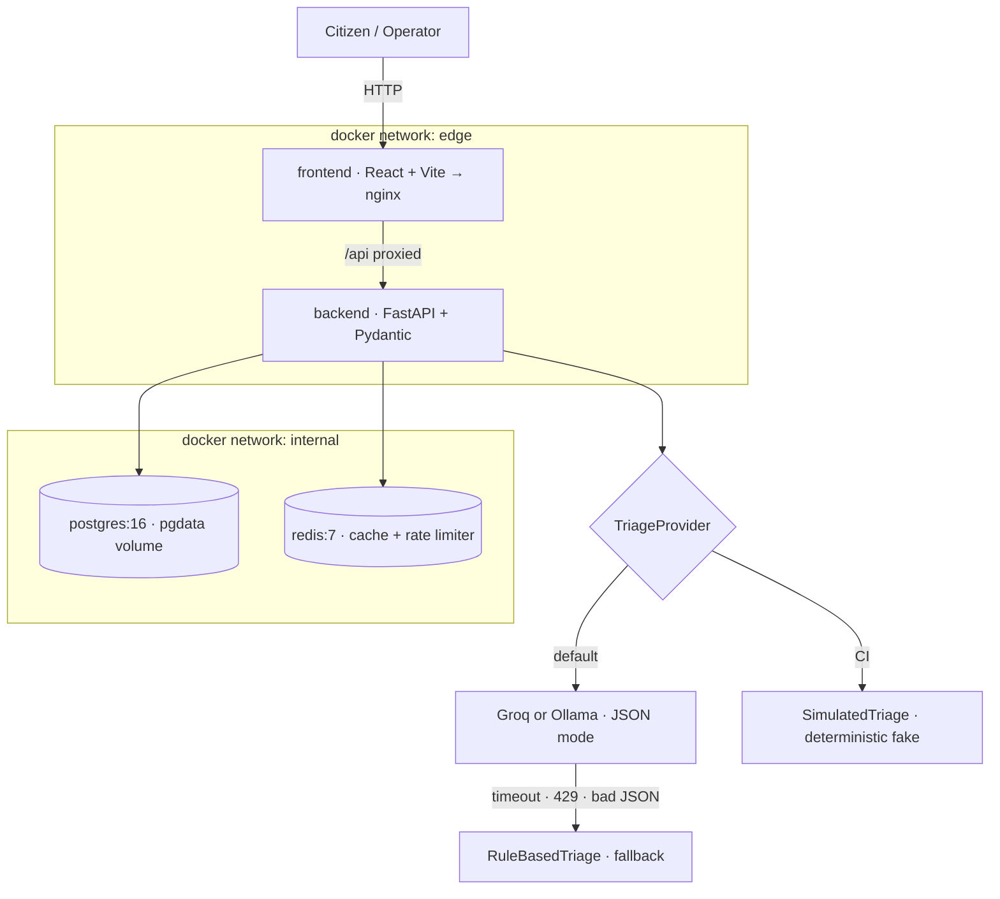

# CivicPulse


**An end-to-end municipal complaint intake, triage and operations platform.**

## The problem

A citizen reports a burst water main into a free-text form. That text lands in an
undifferentiated queue alongside streetlight complaints and noise reports, with nothing to sort
urgent from routine. By the time a human reads far enough down the queue to reach it, a street is
flooded. A dropdown doesn't fix this — citizens pick the wrong category, pick "Other" to get
through the form faster, and can't judge urgency themselves. The information is already in the
text; something has to read it, and that reader has to be replaceable — today a keyword rule,
tomorrow an LLM, next year a fine-tuned classifier — without the system falling over when the
clever one is rate-limited, slow, or wrong.

## What it does

CivicPulse validates each submission, triages it with an LLM into a category, priority and
one-line summary, persists it durably, and surfaces it on a live operations dashboard with
aggregate statistics — with automatic, deterministic fallback if the AI provider is slow,
rate-limited, or unavailable. The whole thing runs as five cooperating containers on a laptop
with one command, and as a scaled, probed, autoscaling workload on Kubernetes in CI.

## Stack

| Layer | Technology |
|-------|------------|
| Frontend | React 18, Vite, TypeScript, served by nginx |
| Backend | FastAPI, Pydantic v2, SQLAlchemy 2.0 |
| Database | PostgreSQL 16, Alembic migrations |
| Cache | Redis 7 (stats cache + distributed rate limiter) |
| AI | Groq / Ollama / rule-based fallback, pluggable provider interface |
| Infra | Docker Compose, Kubernetes (Kustomize), GitHub Actions CI/CD |

## Architecture

The backend follows a strict four-layer separation, dependency arrows pointing one way only:
`routes/` (HTTP only) → `services/` (business rules) → `repositories/` (all SQL lives here, and
nowhere else) → `providers/` (outbound integrations — LLM, cache — behind interfaces, so swapping
one never touches business logic).



`frontend` and `backend` share the `edge` network; only `backend` also joins `internal`, which has
no route to the outside world. That's what makes `docker compose exec frontend ping postgres`
fail — the frontend has no path to the database, by construction, not by convention.

## Quickstart (one command)

```bash
git clone https://github.com/momnakhan24/civicpulse.git
cd civicpulse
cp .env.example .env
docker compose up --build
```

- Frontend: http://localhost:5173
- Backend: http://localhost:8000 (`/health`, `/ready`, `/docs`, `/metrics`)

Seed some realistic data first if you want the dashboard to show more than one complaint:
```bash
docker compose exec backend python -m app.seed
```

### Run it on Kubernetes

```bash
k3d cluster create civicpulse -p "8080:80@loadbalancer"
kubectl apply -k k8s/overlays/dev
kubectl get pods -n civicpulse -w
```

## API

| Method | Path                              | Behaviour                                                        |
|--------|-----------------------------------|---------------------------------------------------------------------|
| POST   | `/api/complaints`                 | Validate → triage → persist. 201, 400 with field errors, 429 on rate limit. |
| GET    | `/api/complaints/{id}`            | 200 / 404                                                            |
| GET    | `/api/complaints`                 | Filter by category/priority/status, paginated (`page`, `page_size`)  |
| PATCH  | `/api/complaints/{id}/status`     | Enforces the state machine; invalid transition → 409                 |
| GET    | `/api/stats`                      | Aggregates, Redis-cached (30s TTL), `X-Cache: HIT\|MISS`              |
| GET    | `/api/meta/providers`             | Active triage provider + last 20 triage outcomes (observability)     |
| GET    | `/health`                         | Liveness — process alive, does not touch the database                |
| GET    | `/ready`                          | Readiness — 200 only if Postgres and Redis are reachable, 503 names which failed |
| GET    | `/metrics`                        | Prometheus text format                                               |

Full interactive schema at `/docs` once the backend is running.

## Status transitions

```
open → in_progress → resolved
open → rejected
in_progress → rejected
```
`resolved` and `rejected` are terminal. Any other transition returns `409` naming the attempted
transition.

## Repository layout

```
backend/    FastAPI app: routes → services → repositories → providers, Alembic migrations, tests
frontend/   React + Vite + TypeScript, Dockerfile, nginx.conf
k8s/        Kustomize base + dev/prod overlays
load/       k6 load test script
docs/       RUNBOOK, ENGINEERING-NOTES, ADRs, AI-USAGE, evidence screenshots
.github/    ci.yml, cd.yml, release.yml
```

See `docs/RUNBOOK.md` for deploy/rollback/log operations, `docs/ENGINEERING-NOTES.md` for design
rationale, and `docs/adr/` for the four architecture decision records.

## Screenshots

| Submit | Dashboard | Stats |
|---|---|---|
|  |  |  |

_Add the three screenshots above to `docs/evidence/` — the table renders once they exist._

## License

MIT — see `LICENSE`.
